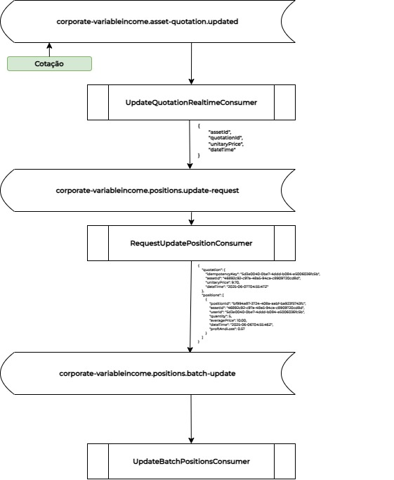

# Corporate.VariableIncome

Esse projeto tem como finalidade contemplar as operações de negócios para Custódia de Renda Variável. Nele se observa atualização em tempo real de cotação de ativo financeiro e posição dos usuários por meio do uso de mensageria com o uso de Apache Kafka. Além disso, operações de compra e venda de ativo financeiro pelo usuário pode ser realizado por meio da API disponibilizada como API Rest.

## Link do Chat com IA
https://chatgpt.com/share/68476853-c3fc-8012-bfd6-71331cd309a1

## Questionamentos, Intenções e Trade-off's

### Modelagem de Banco de Dados Relacional

As chaves primárias foram criadas com o tipo `uuid`, tipo existente em alguns SGBD's, para o MySQL seria correto o uso do CHAR(36), visto que 

#### Tabela users
```sql
CREATE TABLE IF NOT EXISTS users
(
    iduser uuid NOT NULL,
    name character VARCHAR(64) NOT NULL,
    brokerage_fee numeric(9,8) NOT NULL,
    email character VARCHAR(255) NOT NULL,
    CONSTRAINT pk_user_id PRIMARY KEY (iduser)
);

CREATE UNIQUE INDEX IF NOT EXISTS uk_user_email
    ON users (email COLLATE "default");

CREATE UNIQUE INDEX IF NOT EXISTS uk_user_id
    ON users (iduser COLLATE "default");
```

#### Tabela assets
```sql
CREATE TABLE IF NOT EXISTS assets
(
    idasset uuid NOT NULL,
    code character VARCHAR(10) NOT NULL,
    name character VARCHAR(32) NOT NULL,
    CONSTRAINT pk_asset_id PRIMARY KEY (idasset)
)

CREATE UNIQUE INDEX IF NOT EXISTS uk_asset_code
    ON assets (code COLLATE "default")

CREATE UNIQUE INDEX IF NOT EXISTS uk_asset_id
    ON assets (idasset COLLATE "default")
```

#### Tabela operations
```sql
CREATE TABLE IF NOT EXISTS operations
(
    idoperation uuid NOT NULL,
    unitary_price numeric(16,2) NOT NULL,
    quantity integer NOT NULL,
    brokerage_fee numeric(20,6) NOT NULL,
    asset_id uuid NOT NULL,
    user_id uuid NOT NULL,
    operation_date timestamp with time zone NOT NULL,
    type character VARCHAR(255) COLLATE "default" NOT NULL,
    CONSTRAINT pk_operation_id PRIMARY KEY (idoperation),
    CONSTRAINT fk_operation_asset_id FOREIGN KEY (asset_id)
        REFERENCES assets (idasset) MATCH SIMPLE
        ON UPDATE NO ACTION
        ON DELETE CASCADE,
    CONSTRAINT fk_operation_user_id FOREIGN KEY (user_id)
        REFERENCES users (iduser) MATCH SIMPLE
        ON UPDATE NO ACTION
        ON DELETE CASCADE
)

CREATE INDEX IF NOT EXISTS idx_operation_asset_id
    ON operations (asset_id DESC);

CREATE INDEX IF NOT EXISTS idx_operation_date_time
    ON operations (operation_date DESC);

CREATE INDEX IF NOT EXISTS idx_operation_user_id
    ON operations (user_id ASC);

CREATE UNIQUE INDEX IF NOT EXISTS uk_operation_id
    ON operations (idoperation COLLATE "default");
```

#### Tabela quotations

```sql
CREATE TABLE IF NOT EXISTS quotations
(
    idquotation uuid NOT NULL,
    asset_id uuid NOT NULL,
    unitary_price numeric(18,2) NOT NULL,
    quotation_date timestamp with time zone NOT NULL,
    CONSTRAINT pk_quotation_id PRIMARY KEY (idquotation),
    CONSTRAINT fk_quotation_asset_id FOREIGN KEY (asset_id)
        REFERENCES assets (idasset) MATCH SIMPLE
        ON UPDATE NO ACTION
        ON DELETE CASCADE
)

CREATE INDEX IF NOT EXISTS idx_quotation_asset_datetime
    ON quotations (asset_id ASC NULLS LAST, quotation_date ASC NULLS LAST)

CREATE INDEX IF NOT EXISTS idx_quotation_datetime
    ON quotations (quotation_date DESC NULLS FIRST)

CREATE UNIQUE INDEX IF NOT EXISTS uk_quotation_id
    ON quotations (idquotation ASC NULLS LAST)
```

#### Tabela positions
```sql

CREATE TABLE IF NOT EXISTS position_snapshots
(
    idpositionsnapshot uuid NOT NULL,
    asset_id uuid NOT NULL,
    user_id uuid NOT NULL,
    quantity integer NOT NULL,
    average_price numeric(16,2) NOT NULL,
    snapshot_datetime timestamp with time zone NOT NULL,
    proft_and_loss numeric(20,6) NOT NULL,
    CONSTRAINT pk_position_snapshot_id PRIMARY KEY (idpositionsnapshot),
    CONSTRAINT fk_position_snapshot_asset_id FOREIGN KEY (asset_id)
        REFERENCES assets (idasset) MATCH SIMPLE
        ON UPDATE NO ACTION
        ON DELETE CASCADE,
    CONSTRAINT fk_position_snapshot_user_id FOREIGN KEY (user_id)
        REFERENCES users (iduser) MATCH SIMPLE
        ON UPDATE NO ACTION
        ON DELETE CASCADE
);

CREATE INDEX IF NOT EXISTS idx_position_snapshot_asset_id
    ON position_snapshots (asset_id ASC NULLS LAST);

CREATE INDEX IF NOT EXISTS idx_position_snapshot_datetime
    ON position_snapshots (snapshot_datetime DESC NULLS FIRST);

CREATE INDEX IF NOT EXISTS idx_position_snapshot_user_id
    ON position_snapshots (user_id ASC NULLS LAST);

CREATE UNIQUE INDEX IF NOT EXISTS uk_position_snapshot_id
    ON position_snapshots (idpositionsnapshot ASC NULLS LAST);
```

### Índices e Performance

**Proposta** O sistema precisa consultar rapidamente todas as operações do usuário nos últimos 30 dia(s).
**Solução/Intenção** Considerando esse requisito funcional, se observa, a necessidade uma chave index para as colunas de "ID do Usuário" e "Data/Hora". Haja, visto que, precisamos de uma consulta performática para as operações relacionadas ao "ID do Usuário" confiabilizando a consulta usando arvore binária pelo banco de dados. E além disso uma **chave index ordenada do maior para o menor** "Descending" para `Data/Hora`, haja visto, que as consultas serão destinadas para as operações dos últimos 30 dias, assim, facilitando a operação de consulta pelo SGBD.

**Proposta** As cotações podem mudar em milésimos de segundos, e deve afetar em real time a Posição dos clientes o P&L e o Preço Médio.
**Solução/Intenção** Se observa uma necessidade clara de busca/consulta rápida e performática da última posição do cliente para um ativo financeiro. Dessa forma, se observa uma necessidade de chave index para ID do Cliente, ID do Ativo e Data/Hora Ordenado do Maior para o menro. Isso visto que a solução de posiçãoo de cliente foi baseada no modelo de snapshot.

### Aplicação

**Proposta** Crie uma aplicação em .Net Core em C# que acesse os dados de operações de um usuário e calcule o total investido por ativo, a posição por papel de um investidor, a posição global de um cliente com lucro ou prejuízo, e o total de corretagem por cliente.
**Solução/Intenção**

### Lógica de Negócio - Preço Médio

**Proposta** Implemente um método que receba todas as compras de um ativo e calcule o preço médio ponderado de aquisição.
**Solução** Como preço médio é afetado diretamente pela operações de compra do cliente, o cálculo do preço médio foi desenvolvido dentro do contexto de Operações, seguindo regras de validação de negócio e cálculo do preço médio da operação.

### Testes Mutantes

**Proposta** Explique o conceito de teste mutante e sua importância.
**Solução** Teste de mutação é um modelo de verificação de qualidade dos testes automatizados. Em um teste de mutação insere-se dentro do código a ser testado pequenas mutações (como inversão de comparação) como forma de verificar se os testes unitários observam essas mutações. Se os testes unitários falham, quer dizer que os testes detectou a mudança, caso não, a mutação ocorreu e permaneceu viva durante a verificação. 

Exemplo: Inversão da comparação de quantidade menor que 1. Irá quebrar o teste unitário.

### Integração entre Sistemas

**Proposta** Um microserviço externo envia cotações novas via Kafka. Adicione um Worker Service .NET para consumir essa fila e salvar as cotações. Inclua estratégias de retry e idempotência.
**Solução** Foram criados dois microsserviços, 1 microsserviço para operações de negócio e outro microsserviço para sincronização e atualização em tempo real de cotações e posição dos clientes em tempo real. Foi implementado idempotância para as operações de consumo, assim como, retry na publicação de eventos em caso de erros com log's e observabilidade.

### Escalabilidade & Performance

**Proposta** Com o crescimento do sistema, o volume de operações subiu para 1 milhão/dia. Explique como aplicar auto-scaling horizontal no serviço. Compare estratégias de balanceamento de carga (round-robin vs latencia).
**Solução** O auto-scaling horizontal pode ser feito através de ferramenta de gerenciamento de containers como Kubernetes, AKS ou Amazon EKS, onde ocorre o número máximo de escalas horizontais que podem ocorrer, a configuração do ambiente, assim como, a configuração inicial do número de pods que irá rodar dentro do cluster. Além disso, vale ressaltar, que a configuração pode ser realizada com a replicação dos clusters por região, de forma a aumentar a escala e disponibilidade dos serviços. Quanto as estratégias de balanceamento **round-robin** consiste no balanceamento sequencial das requisições, enquanto que o balanceamento por latência consisten no balanceamento visando saúde e disponibilidade de performance das aplicações.

## Esquema 

